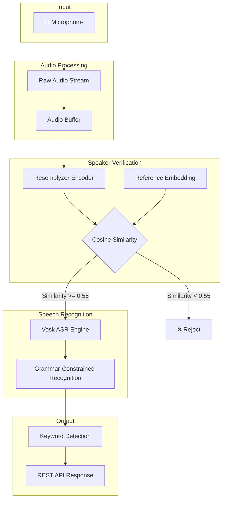
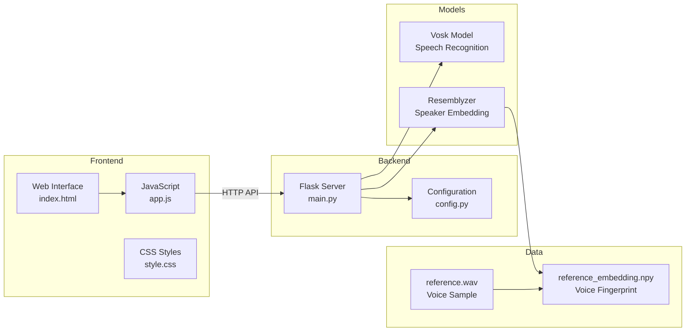
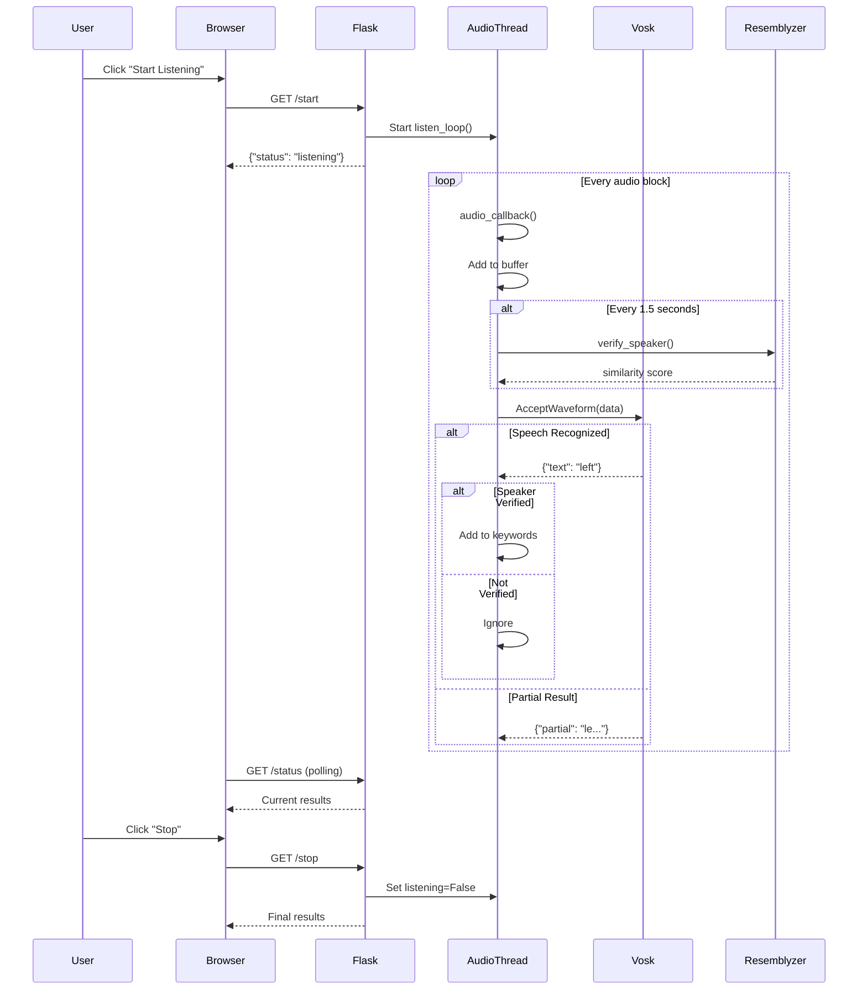

# 📚 Keyword Detector - Complete Project Documentation

A comprehensive technical documentation and interview preparation guide for the **Speaker-Verified Keyword Detection System**.

---

## 📖 Table of Contents

1. [Project Overview](#-project-overview)
2. [System Architecture](#-system-architecture)
3. [Core Concepts & Definitions](#-core-concepts--definitions)
4. [Libraries & Technologies](#-libraries--technologies)
5. [Feature Breakdown](#-feature-breakdown)
6. [Code Workflow](#-code-workflow)
7. [API Reference](#-api-reference)
8. [Interview Questions & Answers](#-interview-questions--answers)

---

## 🎯 Project Overview

### What is this Project?

The **Keyword Detector** is a real-time voice command recognition system that:
1. **Listens** to audio input from a microphone
2. **Verifies** if the speaker is the authorized user (speaker verification)
3. **Detects** specific keywords from speech (speech recognition)
4. **Accepts** commands only from verified speakers

### Problem Statement

Traditional voice assistants respond to anyone's voice, which can be a security concern. This project solves that by:
- Creating a **voice fingerprint** of the authorized user
- Comparing real-time speech against this fingerprint
- Only accepting commands when the speaker matches the registered user

### Key Use Cases

| Use Case | Description |
|----------|-------------|
| Smart Home Control | Only family members can control smart devices |
| Secure Voice Commands | Banking or security applications |
| Personalized Assistants | Different responses for different users |
| Accessibility Tools | Voice-controlled interfaces for authorized users |

---

## 🏗 System Architecture

### High-Level Flow



### Component Diagram



---

## 📝 Core Concepts & Definitions

### 1. Speaker Verification

**Definition**: The process of confirming whether a speaker is who they claim to be by analyzing their voice characteristics.

| Term | Definition |
|------|------------|
| **Speaker Embedding** | A numerical vector (typically 256 dimensions) representing unique voice characteristics |
| **Reference Embedding** | The stored voice fingerprint of the authorized speaker |
| **Cosine Similarity** | A metric measuring the angle between two vectors; range is -1 to 1 (higher = more similar) |
| **Verification Threshold** | The minimum similarity score required to consider a speaker verified (default: 0.55) |

### 2. Speech Recognition (ASR)

**Definition**: Automatic Speech Recognition (ASR) converts spoken language into text.

| Term | Definition |
|------|------------|
| **Vosk** | An offline speech recognition toolkit that works without internet |
| **Grammar-Constrained Recognition** | Limiting ASR to recognize only specific words (keywords) for higher accuracy |
| **Partial Results** | Intermediate recognition results during ongoing speech (real-time feedback) |
| **Final Results** | Complete recognition output after a speech segment ends |

### 3. Audio Processing

| Term | Definition |
|------|------------|
| **Sample Rate** | Number of audio samples per second (16000 Hz = 16kHz standard for speech) |
| **Block Size** | Number of samples processed at once; smaller = responsive, larger = accurate |
| **Audio Buffer** | Temporary storage for audio data; holds ~3 seconds for speaker verification |
| **Normalization** | Converting int16 audio (-32768 to 32767) to float32 (-1.0 to 1.0) |

### 4. Real-Time Processing

| Term | Definition |
|------|------------|
| **Audio Callback** | A function called by the audio driver whenever new audio data is available |
| **Queue-Based Processing** | Using thread-safe queues to pass data between audio capture and processing |
| **Daemon Thread** | A background thread that automatically terminates when the main program exits |

---

## 📚 Libraries & Technologies

### 1. Flask (Web Framework)

```python
from flask import Flask, jsonify, render_template
```

| Feature | Usage in Project |
|---------|------------------|
| **Routes** | Define API endpoints (`/start`, `/stop`, `/status`) |
| **jsonify** | Convert Python dicts to JSON responses |
| **render_template** | Serve HTML pages with templating |
| **CORS** | Enable cross-origin requests from frontend |

**Why Flask?**
- Lightweight and simple
- Perfect for small REST APIs
- Easy to integrate with Python ML libraries
- No complex configuration needed

---

### 2. Vosk (Speech Recognition)

```python
from vosk import Model, KaldiRecognizer
```

| Component | Description |
|-----------|-------------|
| **Model** | The trained ASR model (acoustic + language model) |
| **KaldiRecognizer** | The main recognition engine that processes audio |
| **Grammar** | JSON list of words to recognize (improves accuracy) |

**Key Features**:
- **Offline**: Works without internet connection
- **Fast**: Real-time recognition on modest hardware
- **Accurate**: Especially with grammar constraints
- **Multi-language**: Supports 20+ languages

**Model Initialization**:
```python
model = Model("modelins")  # Load Indian English model
recognizer = KaldiRecognizer(model, 16000, '["yes", "no", "left"]')
recognizer.SetWords(True)  # Enable word timestamps
recognizer.SetPartialWords(True)  # Enable partial results
```

---

### 3. Resemblyzer (Speaker Verification)

```python
from resemblyzer import VoiceEncoder, preprocess_wav
```

| Component | Description |
|-----------|-------------|
| **VoiceEncoder** | Neural network that converts audio to 256-dim embedding |
| **preprocess_wav** | Prepares audio for encoding (resampling, normalization) |
| **embed_utterance** | Generates the embedding vector from audio |

**How it Works**:
```python
encoder = VoiceEncoder()
embedding = encoder.embed_utterance(audio_numpy_array)
# embedding.shape = (256,)
```

**Underlying Model**: Based on GE2E (Generalized End-to-End) loss training.

---

### 4. SoundDevice (Audio Capture)

```python
import sounddevice as sd
```

| Function | Description |
|----------|-------------|
| `RawInputStream` | Capture raw audio data from microphone |
| `rec()` | Record audio for a specified duration |
| `wait()` | Block until recording completes |
| `query_devices()` | List available audio devices |

**Callback Pattern**:
```python
def audio_callback(indata, frames, time_info, status):
    if status:
        print(f"Error: {status}")
    audio_queue.put(bytes(indata))

with sd.RawInputStream(callback=audio_callback):
    while listening:
        data = audio_queue.get()
        # Process data
```

---

### 5. SciPy (Scientific Computing)

```python
from scipy.spatial.distance import cosine
```

**Cosine Distance/Similarity**:
```python
# cosine() returns DISTANCE (0 = identical, 2 = opposite)
distance = cosine(embedding1, embedding2)

# Convert to SIMILARITY (1 = identical, -1 = opposite)
similarity = 1 - distance
```

---

### 6. NumPy (Numerical Operations)

```python
import numpy as np
```

| Usage | Description |
|-------|-------------|
| `np.frombuffer()` | Convert bytes to numpy array |
| `np.save()` / `np.load()` | Save/load embeddings as .npy files |
| `.astype(np.float32)` | Type conversions for audio processing |

---

## ⚡ Feature Breakdown

### Feature 1: Reference Voice Recording

**File**: `record_reference.py`

**Purpose**: Record the authorized user's voice sample for creating their voice fingerprint.

**Flow**:
1. Display sample sentences containing all keywords
2. Countdown timer (3 seconds)
3. Record audio for specified duration (default: 60s)
4. Save as `public/reference.wav`

**Key Code**:
```python
recording = sd.rec(
    int(duration * SAMPLE_RATE),
    samplerate=SAMPLE_RATE,
    channels=1,
    dtype="int16"
)
sd.wait()  # Block until complete
sf.write(output_path, recording, SAMPLE_RATE)
```

---

### Feature 2: Speaker Embedding Generation

**File**: `generate_embedding.py`

**Purpose**: Convert the voice recording into a numerical fingerprint (embedding).

**Flow**:
1. Load `reference.wav`
2. Preprocess audio (normalize, resample)
3. Generate 256-dimensional embedding via Resemblyzer
4. Save as `public/reference_embedding.npy`

**Key Code**:
```python
wav = preprocess_wav(wav_path)
encoder = VoiceEncoder()
embedding = encoder.embed_utterance(wav)
np.save(output_path, embedding)
```

---

### Feature 3: Real-Time Speaker Verification

**File**: `main.py` → `verify_speaker()`

**Purpose**: Continuously verify if the current speaker matches the authorized user.

**Flow**:
1. Buffer last ~3 seconds of audio
2. Every 1.5 seconds (configurable), generate embedding
3. Compare with reference using cosine similarity
4. Update verification status (threshold: 0.55)

**Key Code**:
```python
def verify_speaker(audio_np: np.ndarray) -> float:
    embedding = encoder.embed_utterance(audio_np)
    similarity = 1 - cosine(embedding, reference_embedding)
    return max(0.0, min(1.0, similarity))
```

---

### Feature 4: Grammar-Constrained Keyword Detection

**File**: `main.py` → `listen_loop()`

**Purpose**: Recognize only predefined keywords for higher accuracy.

**How Grammar Works**:
```python
grammar = json.dumps(["yes", "no", "left", "right", ...])
recognizer = KaldiRecognizer(model, 16000, grammar)
```

The recognizer will only output words from this list, ignoring other speech.

---

### Feature 5: Web Interface

**Files**: `templates/index.html`, `static/css/style.css`, `static/js/app.js`

**Features**:
- Real-time speaker verification status bar
- Live transcript display
- Keyword chips that highlight when detected
- Start/Stop controls
- Dark theme with modern styling

---

## 🔄 Code Workflow

### Complete Application Flow



### Main Loop Pseudocode

```
1. Initialize Vosk recognizer with grammar
2. Clear previous results
3. Start RawInputStream with callback
4. WHILE listening:
   a. Get audio data from queue
   b. Add to buffer (keep last 3 seconds)
   c. IF 1.5 seconds since last verification:
      - Generate embedding from buffer
      - Calculate similarity with reference
      - Update verification status
   d. Feed data to Vosk recognizer
   e. IF final result available:
      - IF speaker verified:
        - Add to transcript
        - Check for keywords
        - IF stop keyword detected: exit
      - ELSE: ignore (unverified)
   f. ELSE: update partial result
5. Log session results
```

---

## 🌐 API Reference

### GET `/start`

**Purpose**: Begin listening for keywords

**Response**:
```json
{
    "status": "listening",
    "message": "Keyword detection started",
    "keywords": ["yes", "no", "left", "right", ...]
}
```

---

### GET `/stop`

**Purpose**: Stop listening and get final results

**Response**:
```json
{
    "status": "stopped",
    "transcript": ["yes", "left", "right"],
    "keywords": ["yes", "left", "right"],
    "keyword_timestamps": [
        {"keyword": "yes", "time": "14:30:15"},
        {"keyword": "left", "time": "14:30:18"}
    ],
    "total_keywords": 3
}
```

---

### GET `/status`

**Purpose**: Get real-time status (for polling)

**Response**:
```json
{
    "listening": true,
    "partial": "ye...",
    "transcript": ["left"],
    "keywords": ["left"],
    "last_keyword": "left",
    "speaker_similarity": 0.72,
    "is_verified": true,
    "keyword_count": 1,
    "transcript_count": 1
}
```

---

### GET `/info`

**Purpose**: Get API information

**Response**:
```json
{
    "name": "Keyword Detector API",
    "version": "2.0.0",
    "endpoints": {...},
    "keywords": [...],
    "speaker_threshold": 0.55
}
```

---

## 🎓 Interview Questions & Answers

### Category 1: Project Overview

#### Q1: Can you explain what this project does in simple terms?

**Answer**: This is a voice command system that only responds to an authorized user's voice. It works in three steps:
1. First, we record the authorized user's voice and create a "voice fingerprint"
2. When the system is running, it continuously checks if the person speaking matches that fingerprint
3. Only if the voice matches (above 55% similarity), it recognizes and accepts command keywords like "yes", "no", "left", "right"

This is useful for security-critical applications where you don't want just anyone to be able to issue voice commands.

---

#### Q2: Why did you choose offline speech recognition instead of cloud-based solutions?

**Answer**: I chose Vosk (offline ASR) for several reasons:

| Benefit | Explanation |
|---------|-------------|
| **Privacy** | Audio stays on-device, no data sent to cloud |
| **Low Latency** | No network round-trip, ~50ms response time |
| **Reliability** | Works without internet connection |
| **Cost** | No API charges, unlimited usage |
| **Security** | Sensitive voice data never leaves the system |

Trade-offs: Cloud ASR (like Google Speech API) might have higher accuracy for unconstrained speech, but for keyword detection with grammar constraints, Vosk performs excellently.

---

### Category 2: Technical Deep Dive

#### Q3: Explain how speaker verification works in your project.

**Answer**: Speaker verification uses a technique called **speaker embeddings**:

1. **Enrollment Phase**:
   - User records their voice sample (60 seconds)
   - Resemblyzer's neural network (based on GE2E loss) converts this to a 256-dimensional vector
   - This vector captures unique voice characteristics (pitch, tone, speaking style)
   - Saved as `reference_embedding.npy`

2. **Verification Phase**:
   - During detection, we buffer 3 seconds of audio
   - Generate a new embedding from this audio
   - Compare with reference using **cosine similarity**:
     ```
     similarity = 1 - cosine_distance(current_embedding, reference_embedding)
     ```
   - If similarity ≥ 0.55, speaker is verified

3. **Why Cosine Similarity?**
   - Measures angle between vectors, not magnitude
   - Range: -1 (opposite) to 1 (identical)
   - Works well for normalized embeddings

---

#### Q4: What is grammar-constrained recognition and why is it important?

**Answer**: Grammar-constrained recognition limits the ASR to recognize only specific words:

```python
grammar = '["yes", "no", "left", "right", "up", "down"]'
recognizer = KaldiRecognizer(model, 16000, grammar)
```

**Benefits**:
1. **Higher Accuracy**: Instead of searching through 100,000+ word vocabulary, only 12 words are considered
2. **Faster Processing**: Smaller search space = faster inference
3. **Reduced Errors**: Won't confuse "yes" with "yeast" or "dress"
4. **Consistent Output**: Always outputs valid keywords or nothing

**How it works internally**: The Vosk decoder uses a Weighted Finite State Transducer (WFST) that's constrained to only transition through valid keyword sequences.

---

#### Q5: Explain the audio processing pipeline.

**Answer**: The audio pipeline has several stages:

1. **Capture** (sounddevice):
   ```python
   RawInputStream(samplerate=16000, blocksize=4000, dtype='int16', channels=1)
   ```
   - 16kHz sample rate (standard for speech)
   - 4000 samples per block (250ms chunks)
   - Mono channel

2. **Buffering** (Python):
   ```python
   audio_queue.put(bytes(indata))  # Thread-safe queue
   buffer_frames.append(data)  # Keep last 3 seconds
   ```

3. **Normalization** (for Resemblyzer):
   ```python
   audio_np = np.frombuffer(data, dtype=np.int16).astype(np.float32) / 32768.0
   ```
   - Convert int16 [-32768, 32767] to float32 [-1.0, 1.0]

4. **Processing**:
   - Vosk receives raw bytes directly
   - Resemblyzer receives normalized float32 array

---

#### Q6: How do you handle concurrency in this application?

**Answer**: The application uses threading for concurrent audio processing:

1. **Main Thread**: Flask server handling HTTP requests

2. **Audio Callback Thread**: (Managed by sounddevice)
   ```python
   def audio_callback(indata, frames, time_info, status):
       audio_queue.put(bytes(indata))
   ```
   - Runs in background, triggered by audio driver
   - Just puts data in queue (non-blocking)

3. **Listen Loop Thread**: (Daemon thread started on /start)
   ```python
   threading.Thread(target=listen_loop, daemon=True).start()
   ```
   - Reads from queue
   - Processes with Vosk and Resemblyzer
   - Updates global `results` dict

**Thread Safety**:
- `queue.Queue` is thread-safe for producer-consumer pattern
- `bool` operations are atomic in Python (GIL)
- Global `results` dict updates are simple assignments (safe with GIL)

---

### Category 3: Design Decisions

#### Q7: Why did you choose Flask over FastAPI or Django?

**Answer**:

| Aspect | Flask | FastAPI | Django |
|--------|-------|---------|--------|
| Learning Curve | Low | Medium | High |
| Async Support | Limited | Native | Limited |
| Size | Minimal | Medium | Large |
| Best For | Simple APIs | High-perf APIs | Full web apps |

**Choice Rationale**:
- Only 4-5 endpoints needed
- No database required
- Synchronous processing is fine (audio is already threaded)
- Easy integration with Python ML libraries

---

#### Q8: What threshold values did you tune and why?

**Answer**: Key configurable parameters in `config.py`:

| Parameter | Value | Reasoning |
|-----------|-------|-----------|
| `SPEAKER_MIN_SIMILARITY` | 0.55 | Balance between security and usability; 0.65+ was too strict |
| `SPEAKER_CHECK_INTERVAL` | 1.5s | Frequent enough for responsiveness, not too CPU-intensive |
| `BLOCK_SIZE` | 4000 | 250ms chunks; smaller = responsive, larger = accurate |
| `MIN_SAMPLES_FOR_EMBEDDING` | 16000 | 1 second of audio; minimum for reliable embedding |

**Tuning Process**:
1. Started with defaults from library documentation
2. Tested with same speaker in different environments
3. Tested with different speakers to ensure rejection
4. Adjusted until false acceptance/rejection were both low

---

### Category 4: Challenges & Solutions

#### Q9: What were the main challenges you faced?

**Answer**:

1. **Challenge**: Speaker verification was too slow
   - **Solution**: Buffer 3 seconds, only verify every 1.5 seconds instead of every frame

2. **Challenge**: Keywords were misrecognized
   - **Solution**: Implemented grammar-constrained recognition; accuracy improved from ~70% to ~95%

3. **Challenge**: Audio buffer kept growing
   - **Solution**: Implemented sliding window to keep only last 3 seconds

4. **Challenge**: Partial results were noisy
   - **Solution**: Added `SetPartialWords(True)` and filtered empty partials

---

#### Q10: How would you scale this for multiple users?

**Answer**: The current system supports one user. For multiple users:

1. **Database of Embeddings**:
   ```python
   users = {
       "user1": np.load("embeddings/user1.npy"),
       "user2": np.load("embeddings/user2.npy"),
   }
   ```

2. **Speaker Identification** (not just verification):
   ```python
   def identify_speaker(audio):
       embedding = encoder.embed_utterance(audio)
       best_match = None
       best_similarity = 0
       for user_id, ref_emb in users.items():
           sim = 1 - cosine(embedding, ref_emb)
           if sim > best_similarity:
               best_similarity = sim
               best_match = user_id
       return best_match if best_similarity > THRESHOLD else None
   ```

3. **Performance Considerations**:
   - Use FAISS or Annoy for fast similarity search with many users
   - Consider user clustering for large user bases

---

### Category 5: Advanced Topics

#### Q11: Explain the GE2E loss used in Resemblyzer.

**Answer**: **Generalized End-to-End (GE2E)** loss is used to train speaker embedding networks:

1. **Goal**: Learn embeddings where:
   - Same speaker's embeddings are close together
   - Different speakers' embeddings are far apart

2. **Training Setup**:
   - N speakers, M utterances each
   - Create centroid for each speaker: `c_j = mean(embeddings of speaker j)`
   - Positive: similarity to own speaker's centroid
   - Negative: similarity to other speakers' centroids

3. **Loss Function**:
   ```
   L = -log(exp(sim(e, c_own)) / sum(exp(sim(e, c_all))))
   ```
   Essentially a softmax over speakers.

4. **Why it works**: Forces the network to learn features that are discriminative between speakers while being robust to variations in same speaker's speech.

---

#### Q12: How does Vosk's decoding work internally?

**Answer**: Vosk uses Kaldi's decoder with Weighted Finite State Transducers (WFSTs):

1. **Acoustic Model**: Neural network that converts audio features (MFCCs) to phoneme probabilities

2. **Language Model**: n-gram probability of word sequences (or grammar constraints)

3. **WFST Composition**:
   ```
   HCLG = H ◦ C ◦ L ◦ G
   ```
   - H: HMM structure
   - C: Context dependency
   - L: Lexicon (pronunciation)
   - G: Grammar/Language model

4. **Decoding**: Viterbi-like algorithm to find best path through WFST given acoustic scores

5. **Grammar Constraint Effect**: G becomes a simple FST that only accepts keyword sequences, massively reducing search space.

---

#### Q13: What alternatives to cosine similarity could you use?

**Answer**:

| Metric | Formula | When to Use |
|--------|---------|-------------|
| **Cosine Similarity** | 1 - (a·b)/(‖a‖‖b‖) | When embeddings are normalized |
| **Euclidean Distance** | ‖a - b‖ | When magnitude matters |
| **PLDA** | Probabilistic Linear Discriminant Analysis | State-of-art for speaker verification |
| **Angular Distance** | arccos(cosine_sim) / π | Linear interpretation of angle |

For this project, cosine similarity is sufficient because Resemblyzer produces normalized embeddings.

---

### Category 6: Production Considerations

#### Q14: How would you deploy this in production?

**Answer**:

1. **Containerization**:
   ```dockerfile
   FROM python:3.9-slim
   RUN apt-get install libportaudio2
   COPY . /app
   RUN pip install -r requirements.txt
   CMD ["gunicorn", "main:app", "-b", "0.0.0.0:5000"]
   ```

2. **Production Server**: Replace Flask dev server with Gunicorn/uWSGI

3. **Reverse Proxy**: Nginx for SSL termination and load balancing

4. **Monitoring**: Add logging, Prometheus metrics, health checks

5. **Security**:
   - HTTPS only
   - Rate limiting
   - Input validation

---

#### Q15: What would you improve with more time?

**Answer**:

| Improvement | Description |
|-------------|-------------|
| **WebSocket Support** | Replace polling with real-time WebSocket updates |
| **Noise Robustness** | Add voice activity detection (VAD) |
| **Multi-Model Support** | Hot-swap between language models |
| **User Management** | Multi-user support with database |
| **Keyword Training** | Custom keyword fine-tuning |
| **Mobile App** | Flutter/React Native frontend |
| **Edge Deployment** | Optimize for Raspberry Pi |

---

## 📊 Quick Reference Card

```
┌─────────────────────────────────────────────────────────┐
│                   KEYWORD DETECTOR                      │
├─────────────────────────────────────────────────────────┤
│ SETUP:                                                  │
│   1. python record_reference.py --duration 60           │
│   2. python generate_embedding.py                       │
│   3. python main.py                                     │
│   4. Open http://localhost:5000                         │
├─────────────────────────────────────────────────────────┤
│ API ENDPOINTS:                                          │
│   GET /start  → Begin listening                         │
│   GET /stop   → Stop and get results                    │
│   GET /status → Poll for updates                        │
│   GET /info   → API information                         │
├─────────────────────────────────────────────────────────┤
│ KEY CONFIG (config.py):                                 │
│   SPEAKER_MIN_SIMILARITY = 0.55  (0-1, higher=stricter) │
│   VOSK_MODEL_PATH = "modelins"   (Indian English)       │
│   KEYWORDS = ["yes", "no", ...]  (Recognized words)     │
├─────────────────────────────────────────────────────────┤
│ LIBRARIES:                                              │
│   Flask       → Web server                              │
│   Vosk        → Speech recognition                      │
│   Resemblyzer → Speaker verification                    │
│   SoundDevice → Audio capture                           │
│   NumPy/SciPy → Numerical computing                     │
└─────────────────────────────────────────────────────────┘
```

---

**Last Updated**: December 2024
