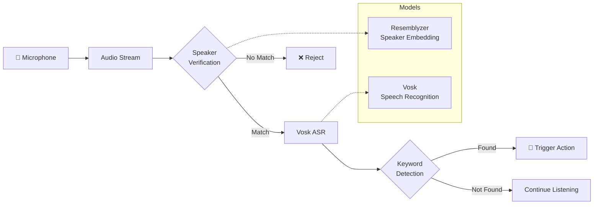

# 🎙️ Keyword Detector

<div align="center">

**A speaker-verified voice command recognition system**

Detect specific keywords from an authorized speaker only — perfect for personalized voice control applications.

[](https://python.org)
[](https://flask.palletsprojects.com/)
[](https://alphacephei.com/vosk/)

</div>

---

## ✨ Features

- 🔐 **Speaker Verification** — Only responds to the registered user's voice
- 🎯 **Keyword Detection** — Recognizes predefined command keywords
- 🇮🇳 **Indian English Support** — Optimized for Indian accent (Vosk model)
- 🌐 **REST API** — Simple Flask-based API for integration
- 🖥️ **Web Interface** — Modern dark-themed UI with real-time updates
- ⚡ **Real-time Processing** — Low-latency voice recognition
- 📝 **Session Logging** — Automatic logging of detected keywords

---

## 🏗️ Architecture



---

## 📋 Prerequisites

- **Python 3.8+**
- **Microphone** — For voice input
- **~200MB disk space** — For Vosk model

---

## 🚀 Quick Start

### 1. Clone the Repository

```bash
git clone https://github.com/Mithun095/voice-detection-model.git
cd keyword_detector
```

### 2. Create Virtual Environment

```bash
python -m venv .venv
source .venv/bin/activate  # Linux/Mac
# or
.venv\Scripts\activate     # Windows
```

### 3. Install Dependencies

```bash
pip install -r requirements.txt
```

### 4. Register Your Voice

Record your reference voice sample (speak for ~30-60 seconds):

```bash
python record_reference.py --duration 60
```

### 5. Generate Voice Embedding

Create your unique voice signature:

```bash
python generate_embedding.py
```

### 6. Start the Server

```bash
python main.py
```

### 7. Open Web Interface

Visit: `http://localhost:5000`

---

## 🎮 Usage

### Web Interface

1. Open `http://localhost:5000` in your browser
2. Click **"Start Listening"**
3. Speak keywords naturally
4. Click **"Stop"** to see results

### API Endpoints

| Endpoint | Method | Description |
|----------|--------|-------------|
| `/` | GET | Web interface |
| `/start` | GET | Start listening for keywords |
| `/stop` | GET | Stop listening, return results |
| `/status` | GET | Get real-time listener status |
| `/info` | GET | API information |

### Example API Usage

```bash
# Start listening
curl http://localhost:5000/start

# Check status
curl http://localhost:5000/status

# Stop and get results
curl http://localhost:5000/stop
```

---

## 🔑 Supported Keywords

The following keywords are detected by default:

| Navigation | Actions | Control |
|------------|---------|---------|
| `left` | `start` | `yes` |
| `right` | `stop` | `no` |
| `up` | `cancel` | `exit` |
| `down` | `back` | |
| `next` | | |

> **Tip:** Customize keywords in `config.py`

---

## ⚙️ Configuration

All settings are in `config.py`:

```python
# Speaker verification threshold (0.0 - 1.0)
# Higher = stricter matching
SPEAKER_MIN_SIMILARITY = 0.55

# Keywords to detect
KEYWORDS = ["yes", "no", "left", "right", ...]

# Vosk model path
VOSK_MODEL_PATH = "modelins"  # Indian English Small
```

---

## 📁 Project Structure

```
keyword_detector/
├── main.py                     # Flask server + keyword detection
├── config.py                   # Configuration settings
├── generate_embedding.py       # Voice embedding generator
├── record_reference.py         # Reference voice recorder
├── requirements.txt            # Python dependencies
├── README.md                   # This file
│
├── templates/                  # HTML templates
│   └── index.html              # Web interface
│
├── static/                     # Static assets
│   ├── css/
│   │   └── style.css           # Stylesheet
│   └── js/
│       └── app.js              # Frontend JavaScript
│
├── public/                     # Generated assets
│   ├── reference.wav           # Your voice recording
│   └── reference_embedding.npy # Voice signature
│
└── modelins/                   # Vosk model (Indian English Small)
    ├── README
    ├── am/
    ├── conf/
    ├── graph/
    └── ivector/
```

---

## 🎯 Model Information

### Current Model

| Property | Value |
|----------|-------|
| **Name** | `modelins` (Indian Small) |
| **Language** | English (Indian Accent) |
| **Size** | ~50MB |
| **Type** | Vosk Mobile Model |

### Alternative Models

| Model | Description | Usage |
|-------|-------------|-------|
| `modelinb` | Indian English Big | Higher accuracy, larger size |
| `hindimodel` | Hindi Language | For Hindi keywords |

> Change the model in `config.py` by setting `VOSK_MODEL_PATH`

---

## 🔧 Troubleshooting

### "Speaker too different" message

- Re-record your reference voice in a quiet environment
- Speak at the same distance from the microphone
- Adjust `SPEAKER_MIN_SIMILARITY` in `config.py` (lower = less strict)

### No audio detected

- Check microphone permissions
- Verify microphone is selected as input device
- Try: `python -c "import sounddevice; print(sounddevice.query_devices())"`

### Keywords not recognized

- Speak clearly and at moderate pace
- Ensure you're using supported keywords
- Check Vosk model is loaded correctly

---

## Acknowledgments

- [Vosk](https://alphacephei.com/vosk/) — Offline speech recognition
- [Resemblyzer](https://github.com/resemble-ai/Resemblyzer) — Speaker verification
- [Flask](https://flask.palletsprojects.com/) — Web framework

---
